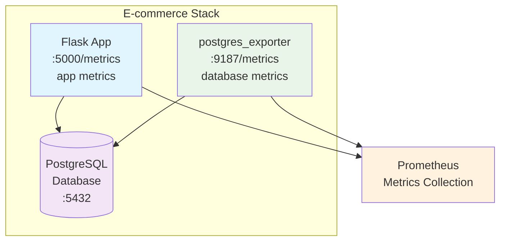

Ainda usando o projeto do day-03, vamos passar a monitorar o postgre também, com seu exporter, exporter pois o postgre não disponibiliza um endpoint nativamente. ele vai ficar entre o postgre e o prometheus

http://github.com/prometheus-community/postgres_exporter

Implementando no Docker

implementamos o exporter segundo a docmentacao do site acima, ao dar um compose up, e depois um container ls voce deve ver 3 resultados (o app, o bd e o exporter). depois veja localhost:9187 voce  vera a tela do exporter, podendo clicar em metriics pra velas

Implementando no kubernetes

apply no 01/k8s deploy.yaml e acessa o service

o exporter vai ser um sidecar do pod do postgres - linha 33
annotations tb foram adc


# **Monitoramento PostgreSQL na TechCommerce**

# 🐘 Monitoramento PostgreSQL na TechCommerce

## 📋 O Novo Desafio: Visibilidade do Banco de Dados

### A Evolução do Problema

Após implementar com sucesso as **métricas de aplicação** (Counter, Gauge, Histogram), você recebe uma nova demanda crítica da Sara (CTO).

**📞 Quinta-feira, 10:15**

> Sara (CTO): "Parabéns pelas métricas da aplicação! Agora temos visibilidade do Flask, mas ainda estamos no escuro sobre o PostgreSQL. Quando a aplicação fica lenta, não sabemos se é código Python ou banco de dados."
> 

**📞 Quinta-feira, 11:30**

> João (Product Manager): "As métricas do carrinho são fantásticas! Mas quero entender: quando um usuário adiciona um produto, o que acontece no banco? Quantas inserções? Como isso afeta o cache? Por que algumas consultas são mais lentas que outras?"
> 

**📞 Quinta-feira, 14:45**

> Maria (Desenvolvedora): "Percebi que nossa aplicação tem ecommerce_cart_additions_total incrementando, mas não vemos os INSERTs correspondentes na tabela order_items. Precisamos correlacionar app e banco! E entender por que o catálogo é rápido mas o carrinho é mais lento."
> 

---

## 🎯 O Diagnóstico Atual

### ✅ **O Que Já Temos (Métricas de Aplicação)**

- **Counter**: `ecommerce_cart_additions_total` - Adições ao carrinho
- **Counter**: `ecommerce_errors_total` - Erros no sistema
- **Gauge**: `ecommerce_active_sessions` - Sessões ativas
- **Histogram**: `ecommerce_request_duration_seconds` - Tempo de resposta HTTP

### ❌ **O Que Está Faltando (Métricas de Banco)**

- **Cache Performance**: Hit ratio por tabela (por que products é rápida vs order_items?)
- **Operações CRUD**: INSERTs/UPDATEs rastreados diretamente no banco
- **Correlação Direta**: 1 adição carrinho = 1 INSERT na tabela order_items
- **Impacto no Cache**: Como operações write-heavy afetam performance
- **Padrões de Acesso**: Read-heavy vs Write-heavy workloads

---

## 🐘 Solução: PostgreSQL Exporter

### **Por Que Usar um Exporter?**

Diferente do Flask (onde adicionamos código Python), o **PostgreSQL não tem suporte nativo ao Prometheus**. A solução é usar um **exporter externo** que:

1. **Conecta no PostgreSQL** via connection string
2. **Executa queries** em views do sistema (`pg_stat_*`)
3. **Expõe métricas** no formato Prometheus
4. **Roda como serviço separado** (container independente)

### **Arquitetura Completa**



---

## 📊 As 3 Métricas Integradas para E-commerce

### **1. 💽 Hit Ratio por Tabela - O Indicador de Performance**

**Conceito:** Percentual de dados encontrados em cache (memória) vs disco para cada tabela específica.

**Fórmula:**

```
# Hit Ratio = (blocos em cache / (blocos em cache + blocos do disco)) × 100
(
  pg_statio_user_tables_heap_blks_hit{relname="products"} /
  (pg_statio_user_tables_heap_blks_hit{relname="products"} + pg_statio_user_tables_heap_blks_read{relname="products"})
) * 100

```

**Padrões Esperados por Tipo de Workload:**

- **🟢 Read-Heavy (products)**: 90-95% - Dados estáticos, muitas consultas
- **🟡 Write-Heavy (order_items)**: 60-80% - Dados novos constantemente (INSERTs)
- **🟡 Mixed (orders)**: 70-90% - Mix de consulta histórico + novos pedidos

**Por Que Varia?**

- **INSERTs frequentes**: Dados novos = cache miss inicial
- **Tabelas estáticas**: Dados permanecem em cache mais tempo
- **Pressure no buffer pool**: Muita atividade remove dados antigos

---

### **2. 📥 INSERTs por Tabela - Correlação Perfeita**

**Métrica:** `pg_stat_user_tables_n_tup_ins{relname="order_items"}`

**Correlação Direta com App:**

```
# Correlação 1:1 perfeita
rate(ecommerce_cart_additions_total[5m])
vs
rate(pg_stat_user_tables_n_tup_ins{relname="order_items"}[5m])

```

**Impacto no Hit Ratio:**

- **Cada INSERT**: Novo bloco de dados → cache miss inicial
- **Muitos INSERTs**: Hit ratio da tabela diminui temporariamente
- **Contraste**: Tabela `products` mantém hit ratio alto (só SELECTs)

**Cenário Prático:**

```
Usuário adiciona produto → INSERT em order_items → Hit ratio order_items cai
Usuário navega catálogo → SELECT em products → Hit ratio products mantém alto

```

---

### **3. ✏️ UPDATEs por Tabela - Finalização do Processo**

**Métrica:** `pg_stat_user_tables_n_tup_upd{relname="orders"}`

**Correlação com Checkout:**

```
# Checkout = UPDATE na tabela orders (is_open=false)
rate(pg_stat_user_tables_n_tup_upd{relname="orders"}[5m])

```

**Impacto no Cache:**

- **UPDATEs**: Podem invalidar cache da linha atualizada
- **Menor impacto**: Comparado a INSERTs (dados já existem)
- **Transação**: Finaliza sessão ativa do usuário

**Cenário Completo:**

```
1. Navegação → products hit ratio: 95%
2. Adicionar carrinho → INSERT order_items → hit ratio cai
3. Checkout → UPDATE orders → finalização

```

---

### **💡 Métrica Bonus: DELETEs (Opcional)**

**Métrica:** `pg_stat_user_tables_n_tup_del{relname="order_items"}`

**Cenário:** Remover item do carrinho
**Conceito:** Cria "dead tuples" que precisam ser limpos pelo VACUUM
**Uso:** Complementa o ciclo CRUD completo

---

## 🔄 Sinergia das Métricas no E-commerce

### **Ciclo Completo do Carrinho:**

```
🔄 Jornada Completa do Usuário:

1. 📖 Navegação (Read-Heavy)
   → SELECTs em products
   → Hit ratio products: 95%+
   → Nenhum INSERT/UPDATE

2. 🛒 Adicionar ao Carrinho (Write-Heavy)
   → INSERT em order_items
   → Hit ratio order_items diminui (dados novos)
   → Correlação: 1 cart_addition = 1 INSERT

3. ✏️ Alterar Quantidade
   → UPDATE em order_items
   → Hit ratio continua baixo
   → Cache invalidation localizada

4. 💳 Finalizar Checkout
   → UPDATE em orders (is_open=false)
   → Correlação: checkout = UPDATE
   → Transação completa

5. 📊 Análise Final
   → products: Hit ratio alto (só leitura)
   → order_items: Hit ratio baixo (write-heavy)
   → orders: Hit ratio médio (mix read/write)

```

### **Por Que Essas Métricas Se Complementam?**

- **Hit Ratio**: Mostra o **IMPACTO** das operações no cache
- **INSERTs**: Correlação **PERFEITA** com ações do usuário
- **UPDATEs**: Correlação **CLARA** com finalização
- **Juntas**: Narrativa **COMPLETA** do e-commerce

## 🎉 Critérios de Sucesso

### ✅ **Implementação Completa**

- [ ]  postgres_exporter rodando na porta 9187
- [ ]  Métricas expostas nos endpoints /metrics
- [ ]  Aplicação funcionando em Docker Compose e Kubernetes
- [ ]  Prometheus pode coletar as métricas automaticamente

### ✅ **Métricas Expostas**

- [ ]  **Flask**: ecommerce_cart_additions_total, ecommerce_active_sessions, ecommerce_request_duration
- [ ]  **PostgreSQL**: pg_stat_user_tables_n_tup_ins, pg_stat_user_tables_n_tup_upd, pg_statio_user_tables_heap_blks_hit
- [ ]  **Hit Ratio**: Cache performance por tabela (products vs order_items)
- [ ]  **CRUD Operations**: INSERTs, UPDATEs rastreados no banco

---

## 🧪 Como Testar

```bash
# Verificar métricas da aplicação Flask
curl <http://localhost:5000/metrics>

# Verificar métricas do PostgreSQL
curl <http://localhost:9187/metrics>

```

---

## 💡 Dicas de Validação

### **Endpoints para Verificar:**

- **Flask App**: `http://localhost:5000/metrics`
- **PostgreSQL**: `http://localhost:9187/metrics`

### **Métricas Essenciais:**

- `ecommerce_cart_additions_total` - Adições ao carrinho
- `pg_stat_user_tables_n_tup_ins` - INSERTs por tabela
- `pg_statio_user_tables_heap_blocks_hit` - Hit ratio por tabela

### **O Que Esperar:**

- Endpoints respondem com métricas no formato Prometheus
- Valores incrementam após usar a aplicação
- Prometheus pode coletar automaticamente