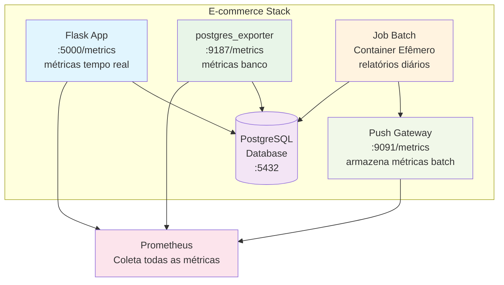

pushgateway

https://prometheus.io/docs/instrumenting/pushing/

cache das métricas de aplicações de curta duraçao, como rotinas, rotinas em batch. Elas nao sao possiveis de monitorar apenas com o prom 

a aplicação em batch enviará as métricas pro push gateway e o prometheus coletará do pushgatway

passos:
-criar o pushgatway
-instrumentação da app (prometheus.github.io/client_python/exporting/pushgateway)

batch: definition.py (definições das métricas), publisher.py (que envia as metricas pro pushgateway), main.py

pushgateway no docker:

para criar o pushgateway, adc service no compose, para criar o batch tb

depois da um compose up e faz a compra na fakeshop

antes de executar o processo em batch, olhe localhost:9091 (pushgateway) e procure daily_sales_revenue_total que é uma metrica definida pro batch (definitions.py)

Após a execução do batch (docker compose --profile batch up -d --build) a metrica mencionada passara a ser mostrada

docker compose logs batch

pushgateway no kubernetes:

diferentemente de no docker, no k8s teriamos o pushgateway e o prometheus em um namespace diferente do resto da aplicacao

aplique ns, rbac, nodeexporter, pushgateway, prometheus, deploy

faça um portforward no svc do push pra velo no browser

rode o batch que ele vai enviar pro push 
> pra rodar, apply no job e get po pra ver o status do job completed. depois dá um kubectl log no job pra ver detalhes. daria erro de 'name or service not known'se nao houvesse o service do typo externalname no job.yaml pra fazer a comunicacao entre o job e o pushgateway. uma alternativa seria colocar o nome completo do service na linha 59 job.yaml

fazendo um port forward 9091 (pushgateway), no /meetrics vai aparecer uma metrica relacionada apenas ao batch (definitions.py), por exemplo report_generation_duration_seconds

# **Push Gateway para Jobs Batch na TechCommerce**

## 📋 O Terceiro Desafio: Jobs Efêmeros e Métricas Batch

### A Nova Realidade do Negócio

Após implementar com sucesso as **métricas de aplicação** e **PostgreSQL Exporter**, você recebe uma demanda crítica sobre automatização de relatórios.

**📞 Segunda-feira, 09:00**

> Sara (CTO): "Agora que temos visibilidade em tempo real, precisamos automatizar nossos relatórios de vendas! Queremos um job diário que processe dados e nos dê insights de negócio."
> 

**📞 Segunda-feira, 10:30**

> João (Product Manager): "Preciso de um relatório PDF automático com faturamento, ticket médio, produtos mais vendidos... E quero métricas desse processo! Quanto tempo demora? Quando foi a última execução?"
> 

**📞 Segunda-feira, 14:00**

> Maria (Desenvolvedora): "O problema é que jobs batch são diferentes da aplicação web. Eles executam, processam e finalizam. Como coletar métricas de algo que não fica online?"
> 

---

## 🎯 O Diagnóstico: Jobs Efêmeros vs Métricas Contínuas

### ✅ **O Que Já Funciona (Aplicações Long-Running)**

- **Flask App**: Endpoint `/metrics` sempre disponível
- **PostgreSQL**: Exporter coletando métricas constantemente
- **Scraping**: Prometheus faz polling regular
- **Visibilidade**: Métricas em tempo real

### ❌ **O Problema dos Jobs Batch**

- **Execução Efêmera**: Container inicia → processa → finaliza
- **Sem Endpoint**: Não há `/metrics` para scraping
- **Timing**: Job pode executar e morrer antes do Prometheus coletar
- **Cron/Scheduling**: Execuções em horários específicos
- **Métricas Perdidas**: Dados importantes não chegam ao Prometheus

### 🔄 **Cenário Típico - O Que Acontece**

```
06:00 → Job Batch inicia container
06:01 → Processa relatório de vendas
06:02 → Gera PDF com 1.2MB
06:03 → Finaliza container
06:05 → Prometheus tenta scraping → 💥 Container já morreu!
```

---

## 💡 Solução: Push Gateway do Prometheus

### **Como Funciona o Push Model**

Diferente do **scraping tradicional** (pull), o Push Gateway inverte o fluxo:

1. **Job Batch** conecta no **Push Gateway**
2. **Envia métricas** via HTTP POST
3. **Push Gateway** armazena temporariamente
4. **Prometheus** faz scraping do Push Gateway
5. **Métricas preservadas** mesmo com job finalizado

### **Arquitetura Completa**



---

## 📊 As 5 Categorias de Métricas Push Gateway

### **1. 💰 Métricas de Negócio - KPIs Automáticos**

```
# Faturamento total do dia processado
daily_sales_revenue_total{date="2025-09-22"} 15420.50

# Quantidade de pedidos processados
daily_sales_orders_count{date="2025-09-22"} 87

# Ticket médio calculado
daily_sales_avg_ticket_amount{date="2025-09-22"} 177.13

# Receita do produto mais vendido
daily_sales_top_product_revenue{date="2025-09-22", product="iPhone 15"} 8900.00

```

**Por Que São Importantes?**

- **Automação**: KPIs calculados sem intervenção manual
- **Histórico**: Métricas preservadas por semanas/meses
- **Alertas**: Notificação se vendas caírem abaixo do esperado

---

### **2. 🚀 Métricas de Performance do Job**

```
# Duração total da geração do relatório
report_generation_duration_seconds{job="daily-sales"} 45.32

# Duração das queries no banco
report_database_query_duration_seconds{job="daily-sales"} 12.45

# Duração da geração do PDF
report_pdf_generation_duration_seconds{job="daily-sales"} 28.67

# Tamanho do PDF gerado (KB)
report_pdf_size_kilobytes{job="daily-sales"} 1203.45

```

**Por Que São Importantes?**

- **SLA Monitoring**: Job deve executar em menos de 2 minutos
- **Debugging**: Identificar se lentidão é query ou PDF
- **Capacity Planning**: PDF crescendo = mais dados processados

---

### **3. ⏰ Métricas de Controle de Execução**

```
# Timestamp da última execução bem-sucedida
batch_job_last_success_timestamp{job="daily-sales"} 1727241600

# Contador de execuções (sucesso vs falha)
batch_job_executions_total{job="daily-sales", status="success"} 127
batch_job_executions_total{job="daily-sales", status="failure"} 3

# Status atual: 1=rodando, 0=parado
batch_job_running{job="daily-sales"} 0

```

**Por Que São Importantes?**

- **Alerting**: Job não executou nas últimas 25 horas
- **Confiabilidade**: Taxa de sucesso deve ser > 95%
- **Debugging**: Identificar padrões de falha

---

### **4. 💾 Métricas de Sistema Durante Execução**

```
# CPU utilizada durante processamento (%)
batch_job_cpu_usage_percent{job="daily-sales"} 23.5

# Memória utilizada em MB
batch_job_memory_usage_mb{job="daily-sales"} 245.8

# Conexões de banco abertas simultaneamente
batch_job_database_connections{job="daily-sales"} 5

# Taxa de processamento (registros/segundo)
batch_job_data_throughput_records_per_second{job="daily-sales"} 156.2

```

**Por Que São Importantes?**

- **Resource Planning**: Dimensionar recursos do container
- **Performance**: Identificar gargalos de sistema
- **Capacity**: Projetar crescimento de dados

---

### **5. 🚨 Métricas de Erro e Retry**

```
# Contadores de erro por tipo
batch_job_errors_total{job="daily-sales", error_type="database"} 1
batch_job_errors_total{job="daily-sales", error_type="pdf"} 0
batch_job_errors_total{job="daily-sales", error_type="network"} 2

# Tentativas de retry por operação
batch_job_retries_total{job="daily-sales", operation="push_metrics"} 3
batch_job_retries_total{job="daily-sales", operation="database_query"} 1

```

**Por Que São Importantes?**

- **Debugging**: Identificar causa raiz de falhas
- **Resilência**: Monitorar efetividade dos retries
- **Infrastructure**: Detectar problemas de rede/banco

---

## 🔄 Integração Completa: Batch + Real-Time

### **Correlação de Métricas Cross-Stack**

```
# Correlação 1:1: Adições carrinho vs Dados no relatório
rate(ecommerce_cart_additions_total[24h])
vs
daily_sales_orders_count

# Performance: App tempo real vs Batch histórico
histogram_quantile(0.95, ecommerce_request_duration_seconds_bucket)
vs
report_generation_duration_seconds

# Sistema: Conexões live vs Conexões batch
pg_stat_activity_count
vs
batch_job_database_connections

```

### **Jornada Completa do Usuário + Relatórios**

```
🔄 Ciclo E-commerce + Business Intelligence:

1. 🛒 Cliente usa site (tempo real)
   → ecommerce_cart_additions_total++
   → pg_stat_user_tables_n_tup_ins{table="orders"}++

2. 📊 Job batch processa (diário 06:00)
   → daily_sales_revenue_total = SUM(orders.total_price)
   → report_generation_duration_seconds = tempo_execução
   → Push Gateway ← métricas

3. 🎯 Business tem dados completos
   → Real-time: métricas operacionais
   → Batch: métricas de negócio consolidadas
   → Alertas: tanto técnicos quanto comerciais

```

---

## 🎯 Sua Missão

Implementar **Push Gateway** para coletar métricas de jobs batch na TechCommerce.

## 🎯 O Que Deve Ser Feito

> Sara (CTO): "Precisamos de um job diário que processe vendas, gere relatórios PDF e nos envie métricas de negócio via Push Gateway."
> 

### **Implementação Necessária**

**1. Push Gateway Setup:**

- Container Push Gateway rodando na porta 9091
- Configuração para persistir métricas entre reinicializações

**2. Job Batch com Métricas:**

- Processamento diário de dados de vendas
- Geração de relatório PDF com KPIs
- Envio de 5 categorias de métricas ao Push Gateway

**3. Integração Completa:**

- Job roda como container efêmero
- Métricas persistem no Push Gateway após job finalizar
- Prometheus coleta do Push Gateway via scraping

### **Resultado Esperado**

✅ Push Gateway rodando e acessível
✅ Job batch executando e gerando relatórios PDF
✅ Métricas de negócio e técnicas enviadas via push
✅ Dados disponíveis no Prometheus após job finalizar
✅ Correlação entre métricas real-time e batch

---

## 🎉 Critérios de Sucesso

### ✅ **Push Gateway Funcionando**

- [ ]  Serviço rodando na porta 9091
- [ ]  Interface web acessível
- [ ]  Endpoint /metrics respondendo
- [ ]  Persistência configurada entre reinicializações

### ✅ **Job Batch Operacional**

- [ ]  Container executa e finaliza corretamente
- [ ]  Relatório PDF gerado no diretório apropriado
- [ ]  Conexão com PostgreSQL funcionando
- [ ]  Logs informativos durante execução

### ✅ **Métricas Push Implementadas**

- [ ]  **Negócio**: daily_sales_revenue_total, daily_sales_orders_count
- [ ]  **Performance**: report_generation_duration_seconds, report_pdf_size_kilobytes
- [ ]  **Controle**: batch_job_last_success_timestamp, batch_job_executions_total
- [ ]  **Sistema**: batch_job_cpu_usage_percent, batch_job_memory_usage_mb
- [ ]  **Erro**: batch_job_errors_total, batch_job_retries_total

### ✅ **Integração Completa**

- [ ]  Métricas visíveis no Push Gateway após job executar
- [ ]  Job pode executar múltiplas vezes sem conflito
- [ ]  Diferentes datas de relatório funcionam (hoje, ontem, data específica)
- [ ]  Push Gateway mantém histórico de execuções

---

## 💡 Dicas de Validação

### **🧪 Testando o Push Gateway**

```bash
# Verificar se Push Gateway está rodando
curl <http://localhost:9091/metrics>

# Interface web para visualizar métricas
open <http://localhost:9091>

# Executar job batch manualmente
docker-compose run --rm batch

# Executar para data específica
REPORT_DATE=yesterday docker-compose run --rm batch

```

### **📊 Métricas Esperadas**

Após executar o job, você deve ver no Push Gateway:

```
# Métricas de negócio com data
daily_sales_revenue_total{date="2025-09-22"}
daily_sales_orders_count{date="2025-09-22"}

# Métricas técnicas com labels de job
report_generation_duration_seconds{job="daily-sales-report"}
batch_job_last_success_timestamp{job="daily-sales-report"}

```

### **🔍 Debugging e Troubleshooting**

**Job falha - sem dados:**

```bash
# Primeiro, gerar dados na aplicação
curl -X POST <http://localhost:5000/add_to_cart> -d '{"product_id": 1, "quantity": 2}'

```

**Push Gateway não acessível:**

```bash
# Verificar se container está rodando
docker-compose ps pushgateway

# Verificar logs do Push Gateway
docker-compose logs pushgateway

```

**Métricas não aparecem:**

```bash
# Verificar logs do job batch
docker-compose run --rm batch

# Verificar se métricas foram enviadas
curl <http://localhost:9091/api/v1/metrics> | grep daily_sales

```

### **✅ Validação Funcional Completa**

1. **Gerar dados**: Use a aplicação para criar pedidos
2. **Executar job**: `docker-compose run --rm batch`
3. **Verificar PDF**: Arquivo gerado em `.docker_volumes/batch_reports/`
4. **Verificar métricas**: Push Gateway mostra todas as 5 categorias
5. **Teste múltiplas execuções**: Job deve funcionar repetidamente
6. **Teste datas diferentes**: `REPORT_DATE=yesterday` deve funcionar